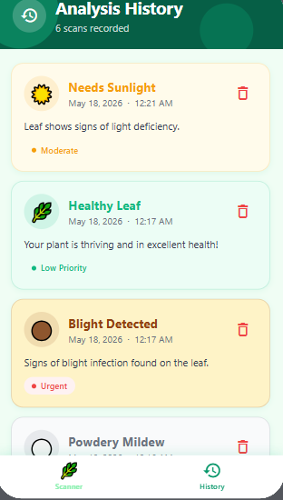

# Leaf-Health-Detector
"Leaf Health Detector is an AI-powered application that scans leaf images to assess plant health.It identifies diseases,nutrients defeciences, and environmental needs such as water, sunlight, and fertilizers, while providing care tips and prioritizing treatment based on severity."
## Features
-Scan leaf images
-detect plant diseases
-suggest care tips 
-show urgency level
## Target users
-farmers
-Gardeners
-Students
## How it works 
-upload or scan a leaf image
-AI analyzes the image
-app shows health status, problems, and solutions
## App Screenshorts
### Home screen

### result screen

## Conclusion
This project demostrates how AI can help farmers, gardeners, and students to detect plant diseases early and improve plant care.
